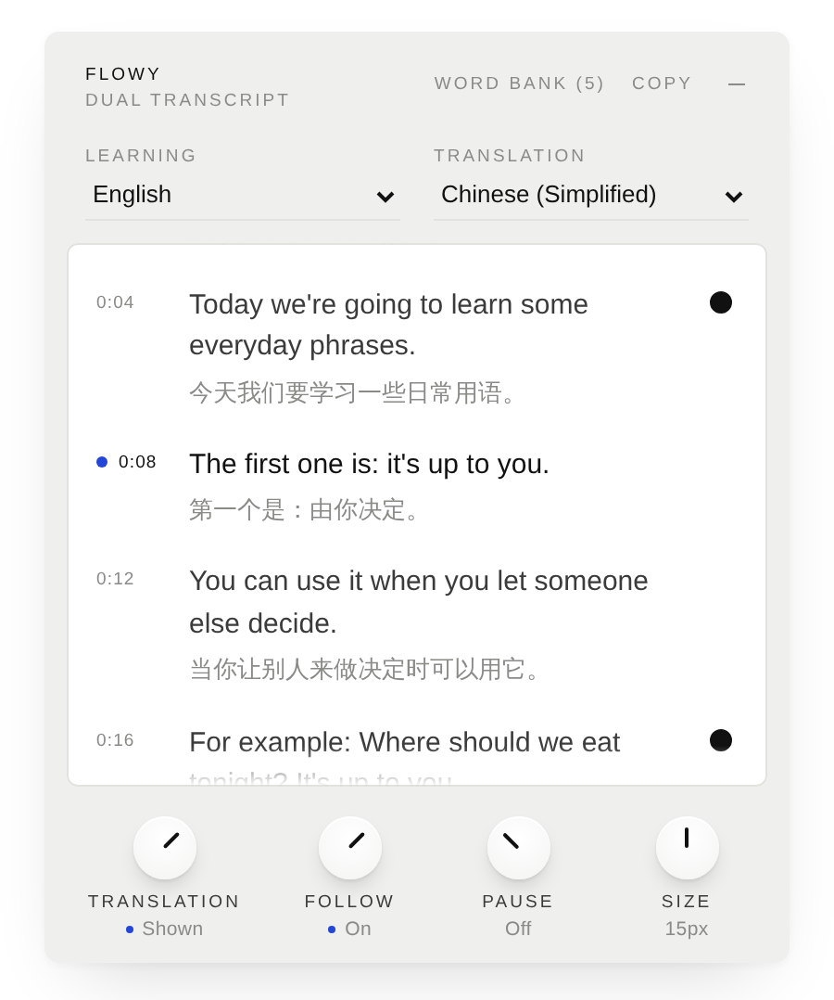
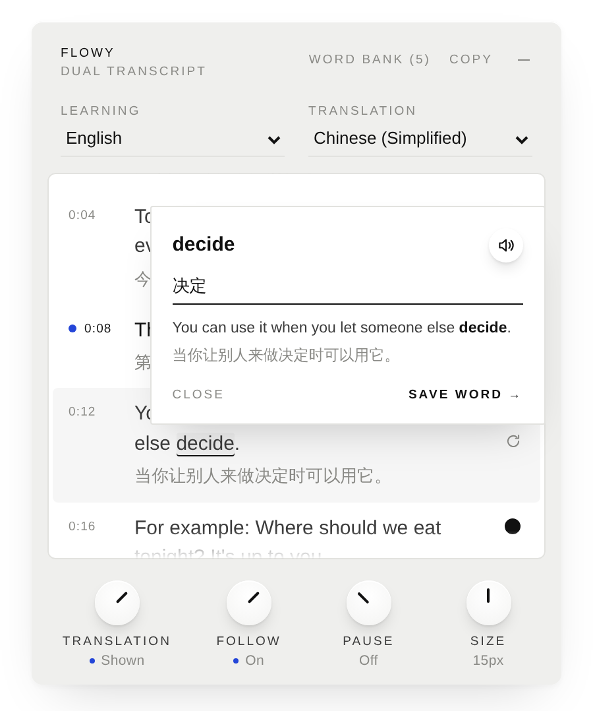
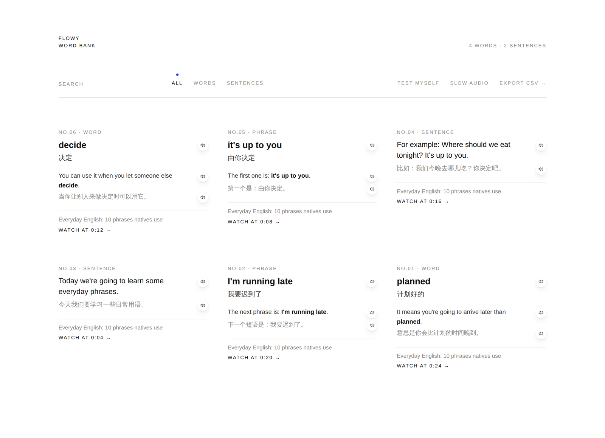

# Flowy

A Chrome extension for learning a language from YouTube. Flowy puts the video's own transcript next to a translation in your language, line by line, and lets you keep the words and sentences you want to remember, with the sentence they came from.

  

## What it does

- **Two transcripts, side by side.** The line being spoken is marked as the video plays. Click any line to jump to it.
- **Learn at your pace.** Loop one line, pause automatically after every line, or blur the translation until you hover.
- **Keep words, phrases and sentences.** Click a word, drag across a phrase, or tap the circle beside a line. Flowy saves it with the video's sentence in both languages and a link back to that moment.
- **Hear it.** Every saved word and sentence can be read aloud, at normal or slow speed.
- **Word Bank.** One quiet page for everything you've saved: search, filter, edit meanings, test yourself, export to CSV (works with Anki and Excel).
- **Any language pair.** English → Chinese by default. Pick any caption track to learn from and any language YouTube can translate into.

  

## Install

Flowy isn't on the Chrome Web Store yet, so you load it yourself. It takes a minute.

1. Click the green **Code** button on this page, then **Download ZIP**, and unzip it.
2. Open `chrome://extensions` in Chrome and switch on **Developer mode** (top right).
3. Click **Load unpacked** and choose the unzipped folder (the one with `manifest.json` inside).
4. Open any YouTube video with captions. The Flowy panel appears on the right.

Keep the folder where it is — Chrome loads Flowy from it. To update, replace the files in the same folder and click ↻ on Flowy's card in `chrome://extensions`. Your saved words stay.

## How it works

- **Captions** come from the YouTube player itself. Flowy briefly turns on YouTube's CC in the background to read the same caption data the player uses, then switches it back.
- **Translations** of full lines use YouTube's own auto-translate.
- **Word meanings** use Chrome's built-in, on-device Translator (Chrome 138+). If it isn't available, you type the meaning yourself.
- **Audio** is spoken by your computer's built-in voices, so nothing is recorded or stored.

## Privacy

Everything stays in your browser. Saved words live in Chrome's local extension storage. Flowy has no server, no account, no analytics, and it only runs on `youtube.com`.

## Limitations

- The video needs captions (creator-made or auto-generated). Videos without any captions won't work.
- Auto-generated captions and auto-translations can be rough.
- YouTube changes often. If captions stop loading, press play for a second and click **Retry** in the panel.

## Files

| File | What it is |
| --- | --- |
| `manifest.json` | Extension settings |
| `page.js` | Runs inside YouTube to read captions and translate words |
| `content.js`, `panel.css` | The transcript panel |
| `vocab.html`, `vocab.js`, `vocab.css` | The Word Bank page |
| `background.js` | Opens the Word Bank from the toolbar icon |

## License

MIT © 2026 Emily Wang
