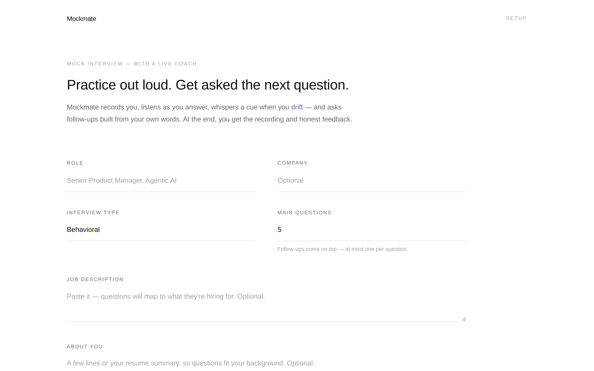

# Mockmate

A mock interview tool with a live coach. It records you on camera, transcribes your answer as you speak, shows short live cues when you drift ("Give a number for the impact"), and asks follow-up questions built from your own words. At the end you get a score, per-answer feedback, speaking stats, and the recording.

**Try it:** https://wenyuew.github.io/emilywang.github.io/mockmate/



## How it works

- **Camera + mic recording** — `MediaRecorder`, stays in your browser; download it at the end.
- **Live transcription** — Web Speech API (Chrome, Edge, Safari). Other browsers fall back to typing.
- **AI interviewer** — Claude picks the next move after each answer: probe with a follow-up that references what you said, or move to a new competency (mapped to the job description if you paste one).
- **Live coach** — every ~10 seconds of speech, Claude returns one ≤8-word cue based on your answer so far.
- **Feedback** — overall score, top fix, strengths, improvements, and a stronger opening for each answer. Talk time, pace and filler words are measured locally.

## Bring your own key

Mockmate calls the Anthropic API directly from the browser with your own key. The key is only sent to Anthropic and, if you choose, remembered in your browser's local storage.

## Run it

It's a single `index.html` — no build step. Camera and mic need a secure page, so serve it over `https://` (e.g. GitHub Pages) or `http://localhost`:

```
python3 -m http.server 8000
```
